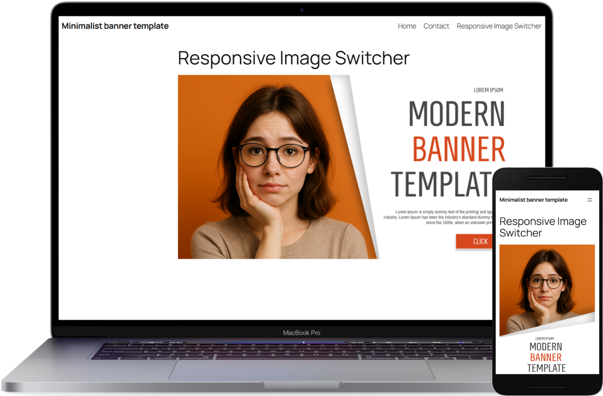

# Responsive Image Switcher



A lightweight Gutenberg block that uses the HTML5 `<picture>` tag to automatically switch between desktop and mobile images for optimal display.

## Table of Contents

- [Features](#features)
- [Installation](#installation)
  - [For WordPress Users](#for-wordpress-users)
  - [For Developers](#for-developers)
- [Usage](#usage)
- [File Structure](#file-structure)
- [Technical Details](#technical-details)
- [Contributing](#contributing)
- [Support](#support)
- [License](#license)

## Features

- **Dual Image Support**: Upload separate images for desktop (≥768px) and mobile (<768px).
- **Zero JavaScript**: Pure HTML5/CSS solution for improved performance.
- **Mobile-First**: Enhances Core Web Vitals scores.
- **Developer Friendly**: Built with modern WordPress standards.
- **Translation Ready**: Includes `.pot` file for localization.

## Installation

### For WordPress Users

1. Download the latest release from [WordPress.org](https://wordpress.org/plugins/responsive-image-switcher/) (available after approval).
2. Navigate to **WordPress Admin → Plugins → Add New → Upload Plugin**.
3. Upload the plugin file and activate it.

### For Developers

1. Clone the repository:
   ```bash
   git clone https://github.com/Getode/responsive-image-switcher.git
   ```
2. Install dependencies:
   ```bash
   npm install
   ```
3. Build the production version:
   ```bash
   npm run build
   ```

## Usage

1. In the Gutenberg editor, add the **Responsive Image Switcher** block.
2. Upload a desktop image (displayed on screens ≥768px).
3. Upload a mobile image (displayed on screens <768px).
4. Save and publish the post or page.

## File Structure

```
responsive-image-switcher/
├── assets/               # Plugin assets
│   └── screenshot.png    # Block preview image
├── build/                # Compiled assets
│   ├── index.js          # Production-ready JavaScript
│   └── index.asset.php   # Dependency management
├── languages/            # Translation files (.pot, .po, .mo)
├── src/                  # Source code (ES6+)
│   └── index.js          # Block registration and editor logic
├── package.json          # Build configuration
└── responsive-image-switcher.php  # Main plugin file
```

## Technical Details

- **Build System**: `@wordpress/scripts` (Webpack/Babel)
- **WordPress APIs Used**:
  - `registerBlockType`
  - `MediaUpload` component
  - WordPress i18n system
- **Browser Support**: All modern browsers (IE11 not supported)

## Contributing

1. Fork the repository.
2. Create a feature branch:
   ```bash
   git checkout -b feature/your-feature
   ```
3. Commit your changes:
   ```bash
   git commit -am 'Add some feature'
   ```
4. Push to the branch:
   ```bash
   git push origin feature/your-feature
   ```
5. Open a Pull Request.

## Support

Found a bug? Please [create an issue](https://github.com/Getode/responsive-image-switcher/issues) on GitHub.

## License

Licensed under the [GNU General Public License v2](https://www.gnu.org/licenses/gpl-2.0.html) or later.
